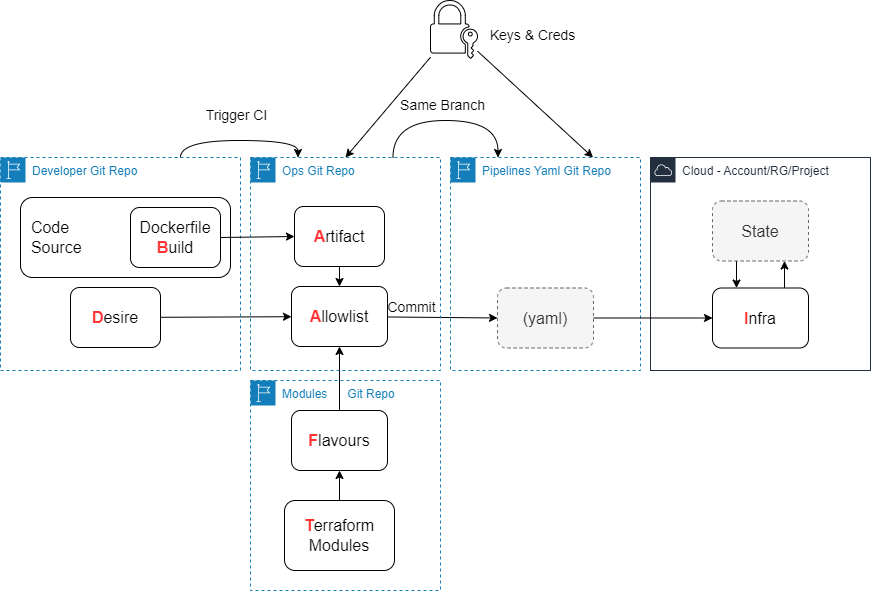

# badafti

A tool and process to better communication between Dev and Ops teams and/or responsibilities while letting each part focus on its process.

## Name meaning

The name includes the processes that are needed to be included in the DevOps pipelines to take the source code and deploy it to an infrastructure

- B - Build the sources using Dockerfiles the developer provided (Test also)
- A - Artifacts, gather
- D - Desire of the programmer in terms of flavors (see next)
- A - Allowlist of the Ops for this project
- F - Flavors, a pre-configured variation of the terraform module
- T - Terraform modules for the specific use case
- I - Infrastructure in the cloud using all of the above and `terraform init`

## Architecture

## Example

This example includes processes. The purpose is to show how Ops teams are free to handle their issues while the developers have a free hand to start infrastructure once authorized.
